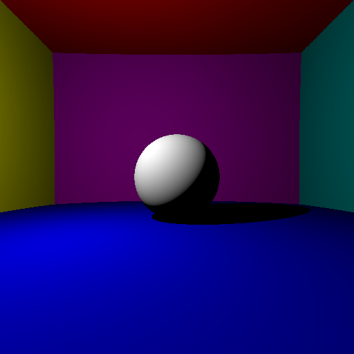
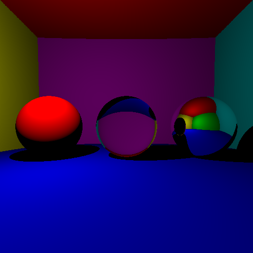
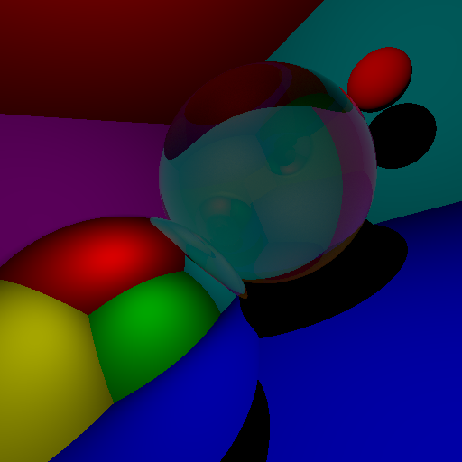
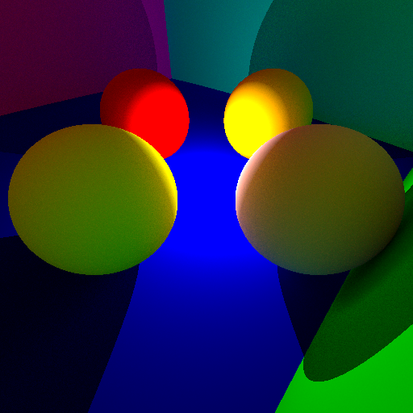
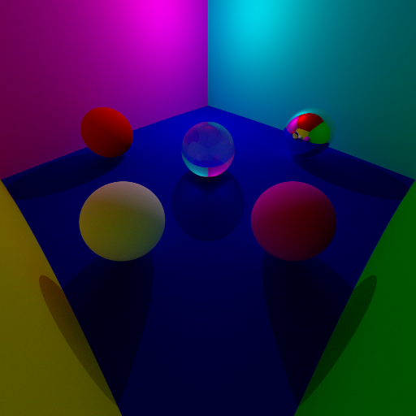
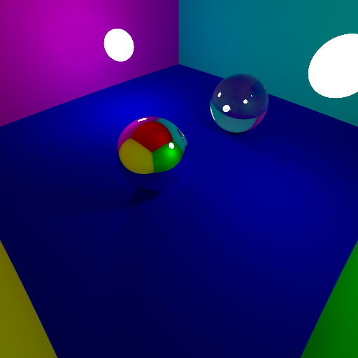
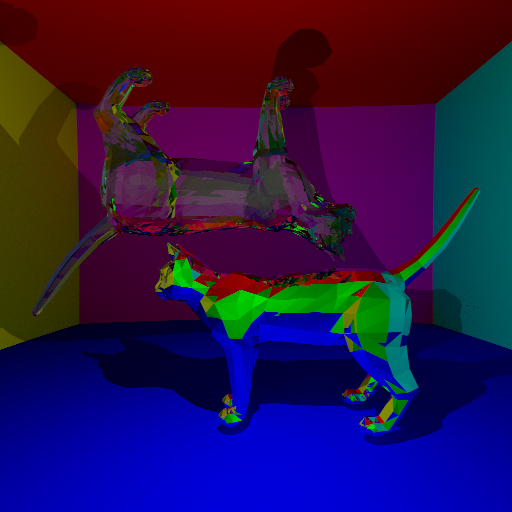
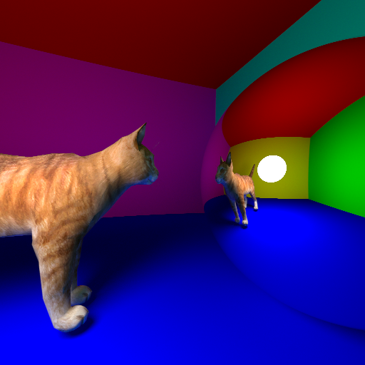

# Computer Graphics - Ray Tracer Report

- Student : Matías DUHALDE
- Date : 2024-03-13

## Introduction

This report describes and showcases the ray tracer implemented as a project for the Computer Graphics course.

The goal of the project was to implement a working, CPU-bound ray tracer that could render 3D scenes containing different elements such as spheres, meshes, and lights using computer graphics techniques.

To achieve this, the ray tracer was written completely in **Rust** (!!) and it can be found in the following repository: <https://github.com/MatiasDuhalde/3d-graphics>

This report will not go in depth into the code, but it will describe the main features of the ray tracer, the techniques used, the results obtained, some benchmarks, and some future improvements that could be made.
The report is particularly visual, and it contains several images that showcase the ray tracer's capabilities.

## Implementation

As mentioned before, the ray tracer was implemented in Rust, in place of the C++ language that was suggested. This was mainly done as a personal challenge, and to force myself to find my own way around the course's challenges instead of making an implementation too close to the examples shown in class.

Rust is a very capable and high-performance language, and it has a very strong type system and memory safety features that make it a good choice for a project like this. It also has good support for parallelism and concurrency.

One can name two fundamental differences between the way Rust and C++ work :

- Rust has strict memory features, and uses concepts like ownership, borrowing, and lifetimes to ensure memory safety. Raw pointers in Rust are not typically used. Instead, objects are managed through references.
- Unlike C++, Rust is not object-oriented, and it does not have classes nor inheritance. Instead, it uses traits and structs to define types and interfaces.

The following external libraries were used in the project:

- `image` for image manipulation and saving, analogous to the `stb_image` library used in the course.
- `rand` for random number generation, analogous to the C++'s `random` standard library.
- `rayon` for parallelism, analogous to OpenMP or other parallelism libraries.

## Usage

The documentation on how to run and use the program can be found in the `README.md` file in the repository: <https://github.com/MatiasDuhalde/3d-graphics>

## Features

The basic features of the ray tracer are:

- Opaque objects
- Shadows
- Specular reflections (Mirror-like objects)
- Refractions (Glass-like, transparent objects)
- Fresnel effect
- Indirect lighting
- Paralellism
- Anti-aliasing
- Spherical lights (Soft shadows)
- Meshes (Triangle-based)
- Bounding box optimization
- Bounding volume hierarchy (BVH) acceleration structure
- Normal interpolation
- Texture mapping (UV mapping)

The extra features that were implemented are:

- Specular and refractive meshes
- Full rotation, translation, and scaling of meshes
- Fully adjustable camera: position, direction, rotation, field of view, resolution
- Multiple light sources

The missing features are:

- Motion blur
- Depth of field
- Russian roulette (path termination)
- Procedural textures (as shown in the last lecture)

## Results

This section showcases the features of the ray tracer with several images, rendering several scene. Each result shows the parameters used to render the scene, and the time it took to render it.
The simulations were run on a **12th Gen Intel i5-12400F (12 cores) @ 4.400GHz** on Linux, using the optimized build.

Note that all simulations are parallelized and all produced images have a resolution of 512x512 pixels.

### Scene 1: Basic spheres

<figure style="page-break-inside:avoid">
    

        
    

</figure>

- Elements:
  - 7 opaque spheres (6 big for the walls, 1 small)
  - 1 point light
- Parameters:
  - Max recursion: 1
  - Rays per pixel: 1
- Time: 0.007 s

### Scene 2: Reflection and refraction spheres

<figure style="page-break-inside:avoid">
    

        
    

</figure>

- Elements:
  - 7 opaque spheres (6 big for the walls, 1 small)
  - 1 mirror sphere
  - 1 glass sphere
  - 1 point light
- Parameters:
  - Max recursion: 5
  - Rays per pixel: 1
- Time: 0.008 s

### Scene 3: Fresnel effect

<figure style="page-break-inside:avoid">
    

        
    

</figure>

- Elements:
  - 7 opaque spheres (6 big for the walls, 1 small)
  - 1 mirror sphere
  - 1 glass sphere
  - 1 point light
- Parameters:
  - Max recursion: 5
  - Rays per pixel: 4096
  - Fresnel: on
- Time: 29.658 s

Note: This image also showcases the camera rotation feature.

### Scene 4: Indirect lighting

<figure style="page-break-inside:avoid">
    

        
    

</figure>

- Elements:
  - 10 opaque spheres (6 big for the walls, 4 small)
  - 1 point light
- Parameters:
  - Max recursion: 5
  - Rays per pixel: 1024
  - Indirect lighting: on
- Time: 44.388 s

### Scene 5: Anti-aliasing

<figure style="page-break-inside:avoid">
    

        
    

</figure>

- Elements:
  - 9 opaque spheres (6 big for the walls, 3 small)
  - 1 glass sphere
  - 1 mirror sphere
  - 1 point light
- Parameters:
  - Max recursion: 5
  - Rays per pixel: 1024
  - Fresnel: on
  - Indirect lighting: on
  - Anti-aliasing: on
- Time: 45.809 s

### Scene 6: Spherical lights (Soft shadows)

<figure style="page-break-inside:avoid">
    

        
    

</figure>

- Elements:
  - 6 opaque spheres (6 big for the walls)
  - 1 glass sphere
  - 1 mirror sphere
  - 2 light spheres
- Parameters:
  - Max recursion: 5
  - Rays per pixel: 1024
  - Fresnel: on
  - Indirect lighting: on
  - Anti-aliasing: on
- Time: 52.407 s

Note: This image also showcases multiple light sources.

### Scene 7: Meshes

<figure style="page-break-inside:avoid">
    

        
    

</figure>

- Elements:
  - 6 opaque spheres (6 big for the walls)
  - 1 transparent mesh
  - 1 specular mesh
  - 1 point light
- Parameters:
  - Max recursion: 5
  - Rays per pixel: 1024
  - Fresnel: on
  - Indirect lighting: on
  - Anti-aliasing: on
- Time: 268.343 s (4 min and 28.343 s)

Note: This image also showcases the mesh rotation feature, and the transparent and specular meshes.

### Scene 8: Mesh normals and texture mapping

<figure style="page-break-inside:avoid">
    

        
    

</figure>

- Elements:
  - 6 opaque spheres (6 big for the walls)
  - 1 textured mesh
  - 1 mirror sphere
  - 1 point light
- Parameters:
  - Max recursion: 5
  - Rays per pixel: 1024
  - Fresnel: on
  - Indirect lighting: on
  - Anti-aliasing: on
  - Normal interpolation: on
- Time: 187.269 s (3 min and 7.269 s)

## Comments on the course

I'm very satisfied with the course. I found it very unique, in the sense that it's very different to everything I've done here in Centrale or in my home university PUC Chile.
I liked how the course integrates several different topics, such as mathematics, optics, algorithms, and parallelism. I also greatly appreciated the hands-on, interactive approach of coding during the lectures.

For me, the most challenging parts were starting out: rendering that very first white circle on a black background, but after that, everything started to go smoothly.
Another part I struggled with was the implementation of the BVH, due to several problems that were hard to debug, but I eventually got it working.

I found the course document (poly_centrale.pdf) to be very useful and mostly easy to understand. It was a good reference to catch up on what I couldn't finish implementing during the lectures.
I personally did not access the recorded lectures, but I did hear others comment that they're a bit outdated and don't correspond to the current version of the course.
